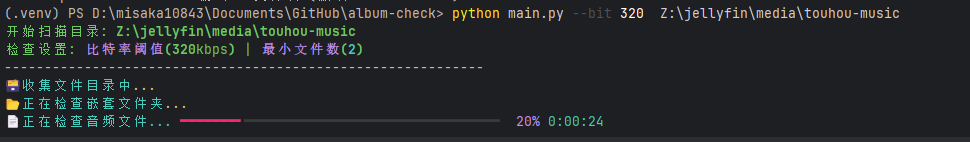
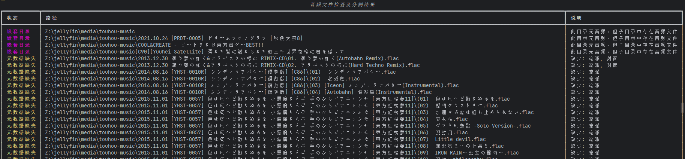
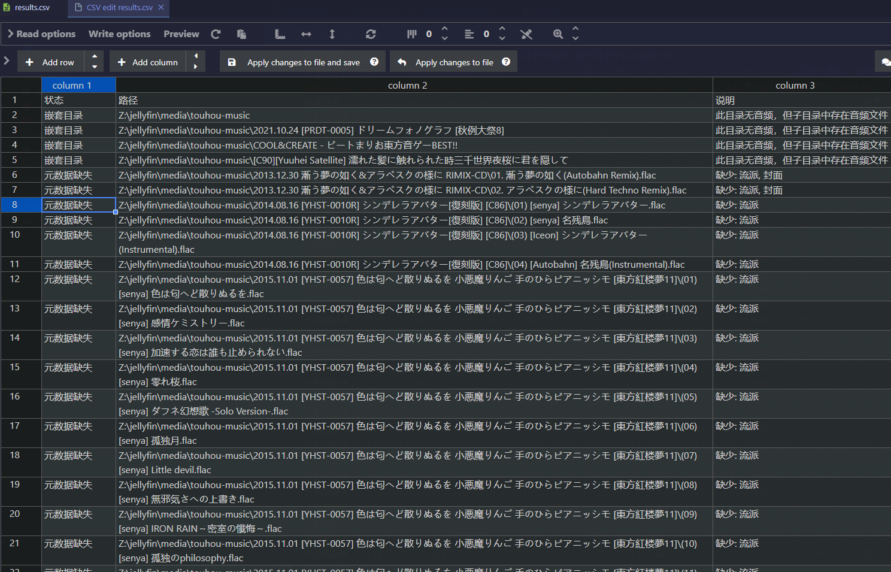

# album-check

<p align="center">

<br>
  一个用来检测音乐库的小工具
</p>

## Why?

因为本人的音乐库早期并没有进行规范化管理，并且下了很多high loss的音频，导致库中非常的乱

因此写了个小工具来方便进行管理

## 支持功能

（所有功能都支持子文件夹）

- [x] 检测文件夹中的音频比特率
- [x] 检测文件夹中的音频元数据（支持排除指定tags）
- [x] 检测文件夹中的音频数量
- [x] 支持检测未分割的CUE文件+音频
- [x] 检测嵌套文件夹(如根目录下的第一级文件夹中并没有音频但有子文件夹中有音频的情况)
- [x] 根据歌曲时长和tags判断是否重复(支持指定判断tag)
- [ ] More functions are under development

## How to use

```bash
git clone https://github.com/misaka10843/album-check.git

cd album-check

pip install -r requirements.txt
```

在安装了依赖之后在项目根目录中即可运行

```bash
(.venv) PS D:\misaka10843\Documents\GitHub\album-check> python main.py -h                                       
usage: main.py [-h] [--min MIN] [--bit BIT] [--skip-tags SKIP_TAGS] [--dup-tags DUP_TAGS] [--output OUTPUT] directory

音频文件质量检查及分割工具

positional arguments:
  directory             要扫描的目录路径

options:
  -h, --help            show this help message and exit
  --min MIN             最小音频文件数量阈值 (默认:
  --bit BIT             最小音频比特率阈值 (默认: 128)
  --skip-tags SKIP_TAGS
                        要跳过检查的元数据，逗号分隔，如: 流派,年份,封面 (支持列表：标题,专辑,艺术家,曲目号,流派,年份)
  --dup-tags DUP_TAGS   用于判断重复的元数据，逗号分隔，默认: 标题 (支持列表：标题,专辑,艺术家,曲目号,流派,年份)
  --output OUTPUT       输出CSV文件名 (默认: results.csv)
```
## 相关截图





